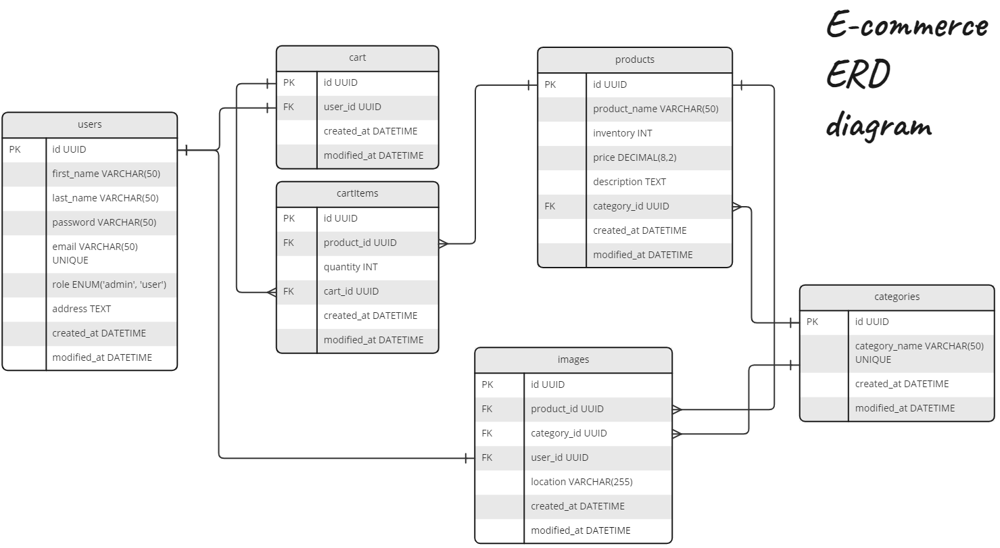

# :memo: E-commerce database design

# Group member:
- Anup Nepal: Make queries for the database.
- Quan Nguyen: Make API endpoints.
- Maksim Pasnitsenko: Make mock data and design individual data structure
- Nhu Nguyen: Make diagram and table relationship.

# Tasks have been done
1. Create ERD diagram for database 
2. Design the API endpoints, following REST API architecture.
3. Database queries using to create database, and CRUD operations.

# ERD diagram for E-commerce database


# Design REST API endpoints
<details>
	<li><a href="https://github.com/mq003at/fs13-Teamwork/tree/main#products">Product</a></li>
	<li><a href="https://github.com/mq003at/fs13-Teamwork/tree/main#users">Users</a></li>
	<li><a href="https://github.com/mq003at/fs13-Teamwork/tree/main#categories">Categories</a></li>
	<li><a href="https://github.com/mq003at/fs13-Teamwork/tree/main#images">Images</a></li>
</details>

## Products 
### Get a single product
**[GET]** /api/products/{id}
- **id**: The id of the product.

### Get all products
**[GET]** /api/products

#### Parameters and Queries

| Name | Type | Description | Required |
| --- | --- | --- | --- |
| **offset** | Number | The index number of the starting item to be returned. | No |
| **limit** | Number | Maximum entries to be returned | No |
| **sortBy** | String | Filtering products by attributes. Can be "name", "quantity", "price", "createdDate", "modifiedDate". | No |
| **sortOrder** | String | How the products are filtered. "asc" or "desc" | No. Can only be used when sortBy is included. |
| **fromRange** | String | Filtering products from range | No. Can only be used when sortBy is included. Not available for "name". |
| **toRange** | String | Filtering products from range | No. Can only be used when sortBy is included. Not available for "name". |

#### Response
```json
[
	{
		"id": 1,
		"product_name": "TShirt",
		"quantity": 23,
		"price": 50,
		"category": "Shirt",
		"images": ["https://www.youtube.com/watch?v=-E_O2PwZpCc"],
		"description": "The book covers the process of development of distributed Systems with Node.js for Enterprise-Ready Backend Services" ,
		"created_at": "21-02-2023",
		"modified_at": "21-02-2023"
	}
    ...,
]
```

#### Example:
The following request will send a GET request to get the first 100 products sorted by price, ascending, from 10 EUR to 100 EUR.

**[URL]** https://www.ecommerce.com/api/v1/products?limit=100&sortBy=price&sortOrder=asc&fromRange=10&toRange=100

### Create a product
**[POST]** /api/products
#### Response
Return the newly created product with the same response from [GET].

### Update a single product
**[PUT]** /api/products/{id}
#### Response
Return the updated product with the same response from [GET].

### Delete a single product
**[DELETE]** /api/products/{id}
#### Response
Return the updated product with the same response from [GET].


## Users
### Get a single user
**[GET]** /api/users/{id}
- **id**: The id of the user.

### Get all users' names
**[GET]** /api/users

#### Response 
```json
[
	{
	    "first_name": "James",
	    "last_name": "Bond",
	    "avatar": ["https://www.youtube.com/watch?v=-E_O2PwZpCc"]
	 },
	 ...,
]
```

### Get all users
**[GET]** /api/users

#### Queries
| Name | Type | Description | Required |
| --- | --- | --- | --- |
| **offset** | Number | The index number of the starting item to be returned. | No |
| **limit** | Number | Maximum entries to be returned | No |
| **sortBy** | String | Filtering products by attributes. Can be "firstName", "lastName", "role", "createdDate", "modifiedDate" | No |
| **sortOrder** | String | How the products are filtered. "asc" or "desc" | No. Can only be used when sortBy is included. |
| **fromRange** | String | Filtering products from range | No. Can only be used when sortBy is included. Not available for "firstName" or "lastName" or "role".|
| **toRange** | String | Filtering products from range | No. Can only be used when sortBy is included. Not available for "firstName" or "lastName" or "role". |

#### Response
```json
[
	{
		"id": "1",
		"first_name": "James",
		"last_name": Bonds,
		"email": "james.bonds@gmail.com",
		"avatar": ["https://www.youtube.com/watch?v=-E_O2PwZpCc"],
		"role": "Admin",
		"address": "Suksisepantie 19, Kokkola, Finland" ,
		"created_at": "2023-02-21",
		"modified_at": "2023-02-21"
	},
	...,
]
```

### Create a user
**[POST]** /api/users
#### Response
Return the newly created users with the same response from [GET].

### Update a user
**[PUT]** /api/users/{id}
#### Response
Return the updated users with the same response from [GET].

### Delete a user
**[DELETE]** /api/users
#### Response
Return the deleted users with the same response from [GET].

## Categories
### Get all categories
**[GET]** /api/categories
#### Queries
| Name | Type | Description | Required |
| --- | --- | --- | --- |
| **sortBy** | String | Filtering products by attributes. Can be "createdDate", "modifiedDate" | No |
| **sortOrder** | String | How the products are filtered. "asc" or "desc" | No. Can only be used when sortBy is included. |
| **fromRange** | String | Filtering products from range | No. Can only be used when sortBy is included. |
| **toRange** | String | Filtering products from range | No. Can only be used when sortBy is included. |
#### Response
```json
[
	{
		"id": "1",
		"category_name": "Shirt",
		"images": ["https://www.youtube.com/watch?v=-E_O2PwZpCc"],
		"created_at": "2023-02-21",
		"modified_at": "2023-02-21"
	},
	...,
]
```

### Get all products from a single category
[GET] /api/categories/{id}
#### Queries
| Name | Type | Description | Required |
| --- | --- | --- | --- |
| **offset** | Number | The index number of the starting item to be returned. | No |
| **limit** | Number | Maximum entries to be returned | No |
| **sortBy** | String | Filtering products by attributes. Can be "name", "quantity", "price", "createdDate", "modifiedDate". | No |
| **sortOrder** | String | How the products are filtered. "asc" or "desc" | No. Can only be used when sortBy is included. |
| **fromRange** | String | Filtering products from range | No. Can only be used when sortBy is included. Not available for "name". |
| **toRange** | String | Filtering products from range | No. Can only be used when sortBy is included. Not available for "name". |
#### Response
```json
[
	{
		"id": 1,
		"product_name": "TShirt",
		"quantity": 23,
		"price": 50,
		"category": "Shirt",
		"images": ["https://www.youtube.com/watch?v=-E_O2PwZpCc"],
		"description": "The book covers the process of development of distributed Systems with Node.js for Enterprise-Ready Backend Services" ,
		"created_at": "21-02-2023",
		"modified_at": "21-02-2023"
	}
    ...,
]
```

### Create a category
**[POST]** /api/categories
#### Response
Return the created category with the same response from [GET].

### Update a category
**[PUT]** /api/categories/{id}
#### Response
Return the updated category with the same response from [GET].

### Delete a category
**[DELETE]** /api/categories/{id}
#### Response
Return the deleted category with the same response from [GET].

## Images
### Get all images
**[GET]** /api/images
#### Queries
| Name | Type | Description | Required |
| --- | --- | --- | --- |
| **group** | String | Which group the images belong to. Can be "user", "category", and "product" | No |
#### Response
```json
[
	{
		"id": "1",
		"product_id": "",
		"category_id": "",
		"user_id": "1",
		"location": "https://www.youtube.com/watch?v=-E_O2PwZpCc",
		"created_at": "21-02-2023",
		"modified_at": "21-02-2023"
	}
    ...,
]
```

### Get a single image
**[GET]** /api/images/{id}
- **id**: The id of the user.

#### Response
Same response from [GET] all images.

### Upload an image
**[POST]** /api/images
Return the created image with the same response from [GET].

### Update a single image
**[PUT]** /api/images/{id}
Return the updated image with the same response from [GET].

### Delete a single image
**[DELETE]** /api/images/{id}
Return the deleted image with the same response from [GET].
